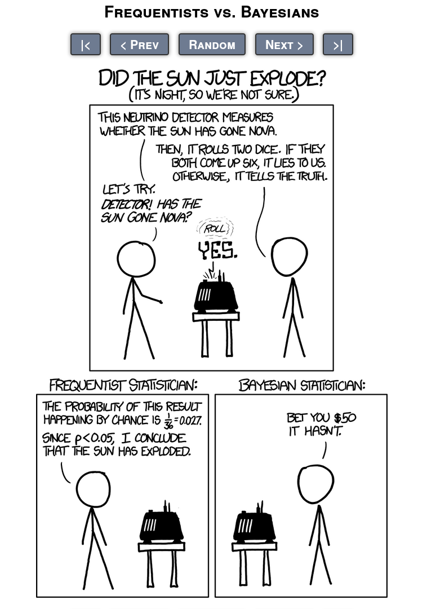

---  
title: Frequentist and Bayesian Statistics
output: 
  html_document
---

&nbsp; 

&nbsp; 

# Frequentist and Bayesian Statistics

## Frequentist vs. Bayesian in a Nutshell 

&nbsp; 

&nbsp; 

<figure>
  
  <figcaption>http://xkcd.com/1132/</figcaption>
</figure>

&nbsp;

## Frequentist inference  

&nbsp; 

* probability = expected frequency of occurrence _in the long run_
* all statistical assertions have always to be seen in the context of _the long run_
* e.g.: control number of errors _in the long run_
* instruments of classical (Fisherian) frequentist statistics lack intuitive meaning:
    + confidence intervals
    + p-values
    + hypothesis testing
* until recently, _the_ way to do statistical inference


```{r, echo=FALSE}
#```{r, echo=FALSE, fig.width=4, fig.height=4}
library(png)
library(jpeg)
library(grid)
library(gridExtra)
img1 <-  rasterGrob(as.raster(readPNG("xkcd2.png")), interpolate = FALSE)
img2 <-  rasterGrob(as.raster(readJPEG("t.jpg")), interpolate = FALSE)
img3 <-  rasterGrob(as.raster(readJPEG("fisher.jpg")), interpolate = FALSE)
grid.arrange(img2,
             img3,
             img1,
             ncol = 3)
```

Sources:  
http://xkcd.com/1478  
https://en.wikipedia.org/wiki/Ronald_Fisher  
https://larspsyll.files.wordpress.com/2015/08/fisher-smoking.jpg

&nbsp;

## Bayesian inference  

&nbsp; 

* probability = plausibility / credibility
* can make assertions about individual events/entities
* concepts more conforming to human thinking
* became much more popular recently because of hardware evolution that made it possible to run large simulations
```{r, echo=FALSE}
img1 <-  rasterGrob(as.raster(readJPEG("bt.jpg")), interpolate = FALSE)
img3 <-  rasterGrob(as.raster(readJPEG("bayes.jpg")), interpolate = FALSE)
img2 <-  rasterGrob(as.raster(readJPEG("laplace.jpg")), interpolate = FALSE)
grid.arrange(img1,
             img2,
             img3,
             ncol = 3)
```

Sources:  
https://en.wikipedia.org/wiki/Bayes_theorem  
https://en.wikipedia.org/wiki/Pierre-Simon_Laplace  


