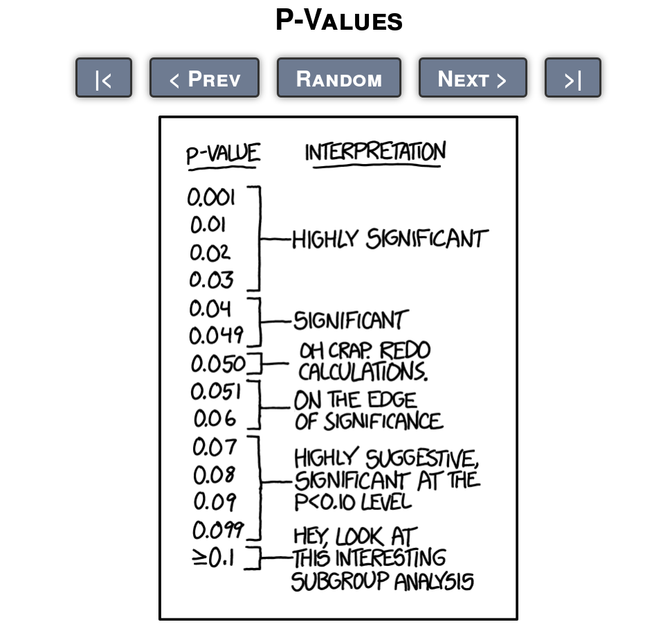
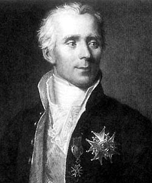

---  
title: Frequentist and Bayesian Statistics
output: 
  html_document
---

&nbsp; 

&nbsp; 


## Frequentist vs. Bayesian in a Nutshell 

&nbsp; 

&nbsp; 

```{r, echo = FALSE, out.width = "350px"}

```

## Frequentist inference  

&nbsp; 

* probability = expected frequency of occurrence _in the long run_
* all statistical assertions have always to be seen in the context of _the long run_
* e.g.: control number of errors _in the long run_
* instruments of classical (Fisherian) frequentist statistics lack intuitive meaning:
    + confidence intervals
    + p-values
    + hypothesis testing
* until recently, _the_ way to do statistical inference

<table>
<tr>
<td></td><td></td><td></td>
</tr>
</table>

Sources:  
http://xkcd.com/1478  
https://en.wikipedia.org/wiki/Ronald_Fisher  
https://larspsyll.files.wordpress.com/2015/08/fisher-smoking.jpg

&nbsp;


## Bayesian inference  

&nbsp; 

* probability is the quantification of _uncertainty_ 
* combines prior knowledge with evidence from the data
* can make assertions about individual events/entities
* became much more popular recently because of hardware improvements

<table>
<tr>
<td></td><td></td><td></td>
</tr>
</table>

Sources:  
https://en.wikipedia.org/wiki/Bayes_theorem  
https://en.wikipedia.org/wiki/Pierre-Simon_Laplace  


